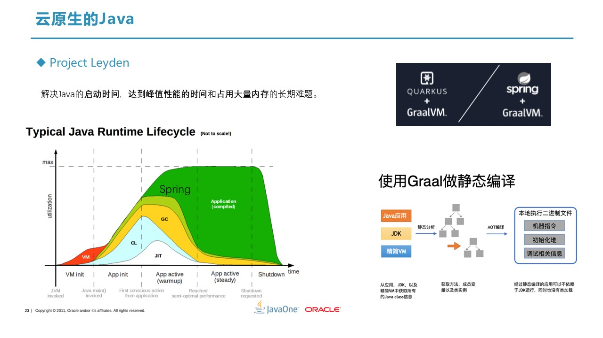
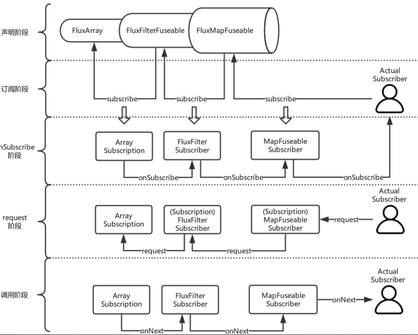

# 反应式编程理论与Reactor源码解析

## 反应式编程理论

### 反应式宣言

> 参考资料：[Reactive反应式架构](./Reactive反应式架构.md)


反应式宣言：**异步** **非阻塞** **带回压** 的方式进行流程控制

技术手段+表现形式：

+ 异步非阻塞 → 相比基于回调和Future的异步开发模型，通过函数式编程和声明式编程更加具有可编排性和可读性。
+ 回压机制 → 通过订阅模型，组装数据流的流水线，下游订阅者可以反压源头，将“推送”模式转换为“推送+拉取”混合的模式。
+ 事件驱动 → 应用内事件循环，使用EventLoop线程模型，能够做到异步非阻塞
+ 消息驱动 → 分布式系统通信和协作，使用反应式的网络通信协议

### 反应式编程适用场景

我们在选择使用反应式编程时，一定要明确它的适用场景，主要包括：

+ 处理由用户或其他系统发起的事件，如鼠标点击、键盘按键或者物联网设备等无时无刻都在发射信号的情况
+ 处理磁盘或网络等高延迟的IO数据，且保证这些IO操作是异步的
+ 业务的处理流程是流式的，且需要高响应的非阻塞操作

### 仍然没有免费的午餐

首先，我们的代码是声明式的，不方便调试，错误发生时不容易定位。使用原生的API，例如不通过Spring框架而直接使用Reactor，会使情况变的更糟，因为我们自己要做很多的错误处理，每次进行网络调用都要写很多样板代码。通过组合使用 Spring 和 Reactor 我们可以方便的查看堆栈信息和未捕获的异常。由于运行的线程不受我们控制，因此在理解上会有困难。

其次，一旦编写错误导致一个Reactive回调被阻塞，在同一线程上的所有请求都会挂起。在servlet容器中，由于是一个请求一个线程，一个请求阻塞时，其它的请求不会受影响。而在Reactive中，一个请求被阻塞会导致所有请求的延迟都增加。

## 一、反应式编程库介绍

实践反应式宣言的编程框架，提供开箱即用的反应式编程手段

### 1.1 为什么要使用反应式编程库？

编写非阻塞、并发和可伸缩的代码是困难的。反应式编程库通过提供基于reactor模式的简单编程模型，提供了构建此类应用程序的最简单方法，这将允许应用程序高效地使用所有硬件资源。

相对于传统的基于回调和Future的异步开发方式，响应式编程更加具有可编排性和可读性，配合lambda表达式，代码更加简洁，处理逻辑的表达就像装配“流水线”，适用于对数据流的处理。

统一的编码方式，在不同的反应式网络协议和编程模型之上，构建了抽象编程层。例如gRPC和RSocket等反应式网络协议，无需了解具体协议细节，直接使用抽象层编程即可实现相关功能。

### 1.2 反应式编程库示例

#### 主流反应式编程框架

+ Reactor-core
+ Spring-Webflux

#### 其他反应式编程框架

+ RxJava

#### 新兴反应式框架套件

+ vert.x
+ Quarkus

> 静态编译技术：GraalVM/Android



### 1.3 反应式编程库和其他异步编程框架的对比

#### Java8

```java
responseHandlerFuture.whenCompleteAsync((r, t) -> {
        if (t == null) {
        responseFuture.complete(r);
        } else {
        responseFuture.completeExceptionally(t);
        }
}, futureCompletionExecutor);
```

#### Guava

```java
responseFuture.addListener(() -> {...}, rpcExecutorService);
```

#### reactor

```java
// sending with async non-blocking io
return Mono
        .fromCompletionStage(() -> {
            // 注①
            CompletableFuture<SendEmailResponse> responseFuture = awsAsyncClient.sendEmail(sendEmailRequest);
            return responseFuture;
        })
        // 注② thread switching: callback executor
        // .publishOn(asyncResponseScheduler)
        // 注③ callback: success
        .map(response -> this.onSuccess(context, response))
        // 注④ callback: failure
        .onErrorResume(throwable -> {
            return this.onFailure(context, throwable);
        });
```

### 1.4 为啥不用Java Stream来进行数据流的操作？

原因在于，若将其用于响应式编程中，是有局限性的。比如如下两个需要面对的问题：

+ Web 应用具有I/O密集的特点，I/O阻塞会带来比较大的性能损失或资源浪费，我们需要一种异步非阻塞的响应式的库，而Java Stream是一种同步API。
+ 假设我们要搭建从数据层到前端的一个变化传递管道，可能会遇到数据层每秒上千次的数据更新，而显然不需要向前端传递每一次更新，这时候就需要一种流量控制能力，就像我们家里的水龙头，可以控制开关流速，而Java Stream不具备完善的对数据流的流量控制的能力。

具备“异步非阻塞”特性和“流量控制”能力的数据流，我们称之为反应式流（Reactive Stream）。

## 二、反应式编程库原理

### 2.1 编程理论

#### 函数式编程风格

> 就像面向对象的编程思想一样，函数式编程只是一系列想法，而不是一套严苛的规定。有很多支持函数式编程的程序语言，它们之间的具体设计都不完全一样。

   1. 延迟执行的
   2. 无副作用
   3. 不可变变量
   4. 并发编程

#### 声明式编程风格

   1. 结合函数式编程
   2. 分隔函数算子，隔离副作用

#### 反应式编程风格

> 响应式编程（reactive programming）是一种基于数据流（data stream）和变化传递（propagation of change）的声明式（declarative）的编程范式。

   1. 函数式+声明式
   2. 延迟执行
   3. 背压
   4. 变化传递，推送

> 本质上都是java编程语言，主要区别在于编程风格和思考逻辑的不同

### 2.2 反应式库的核心接口

组装数据流处理链的几种形式：

#### 1. 链表形式

面向过程

#### 2. 观察者模式

面向对象

Publisher/Subscriber/Subctiption

java9

#### Publisher 即被观察者

Publisher 在 PRR 中 所承担的角色也就是传统的 观察者模式 中的 被观察者对象，在 PRR 的定义也极为简单。

```java
package org.reactivestreams;
public interface Publisher<T> {
    public void subscribe(Subscriber<? super T> s);
}
```

Publisher 的定义可以看出来，Publisher 接受 Subscriber，非常简单的一个接口。但是这里有个有趣的小细节，这个类所在的包是 org.reactivestreams，这里的做法和传统的 J2EE 标准类似，我们使用标准的 Javax 接口定义行为，不定义具体的实现。

#### Subscriber 即观察者

Subscriber 在 PRR 中 所承担的角色也就是传统的 观察者模式 中的 观察者对象，在 PRR 的定义要多一些。

```java
public interface Subscriber<T> {
    public void onSubscribe(Subscription s); ➊
    public void onNext(T t); ➋
    public void onError(Throwable t); 
    public void onComplete(); ➍
}
```

➊ 订阅时被调用
➋ 每一个元素接受时被触发一次
➌ 当在触发错误的时候被调用
➍ 在接受完最后一个元素最终完成被调用

Subscriber 的定义可以看出来，Publisher 是主要的行为对象，用来描述我们最终的执行逻辑。

> 行为是由Subscriber触发的，这是一种Pull模型，如果是Publisher触发，则为Push模型。

#### Subscription 桥接者

在最基础的 观察者模式 中，我们只是需要 Subscriber 观察者 Publisher 发布者，而在 PRR 中增加了一个 Subscription 作为 Subscriber Publisher 的桥接者。

```java
public interface Subscription {
    public void request(long n); ➊
    public void cancel(); ➋
}
```

➊ 获取 N 个元素往下传递
➋ 取消执行

为什么需要这个对象，笔者觉得是一是为了解耦合，第二在 Reference 中有提到 Backpressure 也就是下游可以保护自己不受上游大流量冲击，这个在 Stream 编程中是无法做到的，想要做到这个，就需要可以控制流速，那秘密看起来也就是在 request(long n) 中。

> 中间层，主要用于解耦和流控。

### 2.3 实现原理概括

### 1. 命令式编程


### 2. 声明式编程


常用的、简单的数据流处理链路

Netty

### 3. 函数式编程 Stream

> 去除中间过程，横向改为纵向处理


##### 1. 声明阶段

将Op组装成Pipeline

##### 2. 组装订阅链

生成Sink链

优化：

+ 中间操作合并
+ 终结操作收集数据

##### 3. 执行阶段

执行Sink方法

> 最核心的就是类为AbstractPipeline，ReferencePipeline和Sink接口.AbstractPipeline抽象类是整个Stream中流水线的高度抽象了源头sourceStage，上游previousStage，下游nextStage，定义evaluate结束方法，而ReferencePipeline则是抽象了过滤,转换,聚合,归约等功能，每一个功能的添加实际上可以理解为卷心菜，菜心就是源头，每一次加入一个功能就相当于重新长出一片叶子包住了菜心，最后一个功能集成完毕之后整颗卷心菜就长大了。而Sink接口呢负责把整个流水线串起来，然后在执行聚合,归约时候调AbstractPipeline抽象类的evaluate结束方法，根据是否是并行执行，调用不同的结束逻辑，如果不是并行方法则执行terminalOp.evaluateSequential否则就执行terminalOp.evaluateParallel，非并行执行模式下则是执行的是AbstractPipeline抽象类的wrapAndCopyInto方法去调用copyInto，调用前会先执行一下wrapSink，用于剥开这个我们在流水线上产生的卷心菜。从下游向上游去遍历AbstractPipeline，然后包装到Sink，然后在copyInto方法内部迭代执行对应的方法。最后完成调用

#### 4. 反应式编程 Reactor


反应式编程模型在执行中主要有5条链路:

##### 1. 声明流程

组装reactor执行链路，绑定上下游节点，在 subscribe() 之前，我们什么都没做，只是在不断的包裹 Publisher 将作为原始的 Publisher 一层又一层的返回回来。

生成Publisher

##### 2. 组装订阅链

`subscribe()`

生成Subscriber

> 内存数据发送很简单，就是循环发送。而对于像数据库、RPC 这样的场景，则会触发请求的发送。

> Publisher 接口中的 subscribe 方法语义上有些奇特，它表示的不是订阅关系，而是被订阅关系。即 aPublisher.subscribe(aSubscriber) 表示的是 aPublisher 被 aSubscriber 订阅。

> 对于中间过程的 Mono/Flux，subscribe 阶段是订阅上一个 Mono/Flux；而对于源 Mono/Flux，则是要执行 Subscriber.onSubscribe(Subscription s) 方法。

##### 3. 通知：执行前初始化 + 生成许可

`onSubscribe()`

生成Subscription，并将Subscriber作为成员参数传入

##### 4. 背压流程 

`request(n)`

基于Subscription实现request(n)机制

##### 5. 执行流程

`doNext()`/....

基于Subscription中的Subscriber实现执行机制



## 三、Reactor源码分析

### 3.1 Reactor-core工作原理


 
### 3.2 实现细节

1. 声明阶段: 当我们每进行一次 Operator 操作 （也就 map filter flatmap），就会将原有的 FluxPublisher 包裹成一个新的 FluxPublisher


最后生成的对象是这样的


2. subscribe阶段: 当我们最终进行 subscribe 操作的时候，就会从最外层的 Publisher 一层一层的处理，从这层将 Subscriber 变化成需要的 Subscriber 直到最外层的 Publisher


最后生成的对象是这样的


3. onSubscribe阶段: 在最外层的 Publisher 的时候调用 上一层 Subscriber 的 onSubscribe 函数，在此处将 Publisher 和 Subscriber 包裹成一个 Subscription 对象作为 onSubscribe 的入参数。


4. 最终在 原始 Subscriber 对象调用 request() ，触发 Subscription 的 Source 获得数据作为 onNext 的参数，但是注意 Subscription 包裹的是我们封装的 Subscriber 所有的数据是从 MapSubscriber 进行一次转换再给我们的原始 Subscriber 的。


经过一顿分析，整个 PRR 是如何将操作整合起来的，我们已经有一个大致的了解，通过不断的包裹出新的 Subscriber 对象，在最终的 request() 行为中触发整个消息的处理，这个过程非常像 俄罗斯套娃，一层一层的将变化组合形变操作变成一个新的 Subscriber， 然后就和一个管道一样，一层一层的往下传递。

5. 最终在 Subscription 开始了我们整个系统的数据处理


### 3.3 Reactor示例/高级用法

### flatMap 组装异步流

subscribe()

### publishOn 切换线程

onNext()

### repeat 重试重复机制

request(n)

### limitN 背压控制

request(n)

### 3.4 Reactor流程总结

1. 在声明阶段，我们像 俄罗斯套娃 一样，创建一个嵌套一个的 Publisher
2. 在 subscribe() 调用的时候，我们从最外围的 Publisher 根据包裹的 Operator 创建各种 Subscriber
3. Subscriber 通过 onSubscribe() 使得他们像一个链条一样关联起来，并和 最外围的 Publisher 组合成一个 Subscription
4. 在最底层的 Subscriber 调用 onSubscribe 去调用 Subscription 的 request(n); 函数开始操作
5. 元素就像水管中的水一样挨个 经过 Subscriber 的 onNext()，直至我们最终消费的 Subscriber

## 四、反应式编程总结

### 4.1 编程理论

+ 命令式编程/面向对象编程 → 优缺点，适用场景
+ 函数式编程 → 算子，副作用约束，函数式流编程
+ 声明式编程 → 动词封装，逻辑清晰
+ 反应式编程 → 异步非阻塞，事件驱动/消息驱动，背压

### 4.2 流式框架的设计

+ 同步流框架设计（一线）
  + 函数式流
+ 异步流框架设计（二线）
  + Netty等框架，声明编排
+ 完善的流式框架设计（三线）
  + Java Stream
+ 反应式流框架设计（五线）
  + 反应式编程框架，反应式网络协议

### 4.3 底层原理

+ 异步非阻塞IO原理
  + Epoll，CF
+ 网络协议
  + gRPC，RSocket
+ 传统阻塞IO原理
  + JDBC，BIO